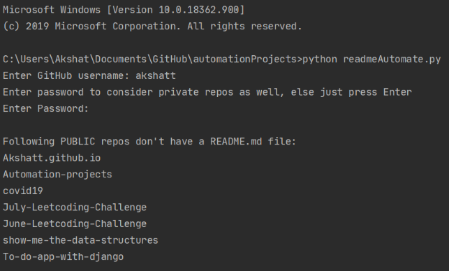
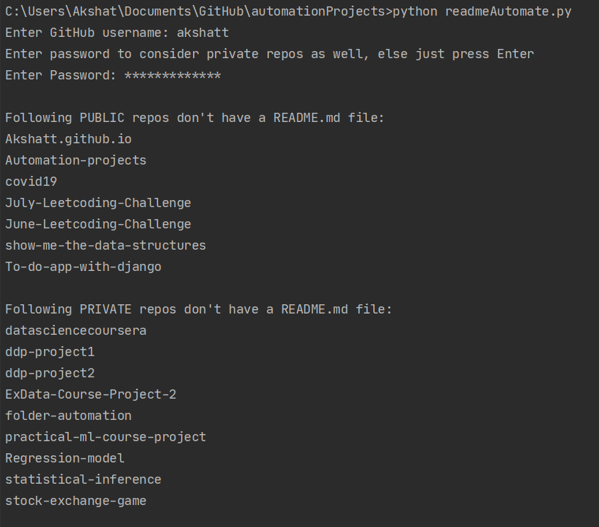

# Automation-projects
Automation projects done using python

## 1. Folder Automation

- Many a times, some folders are an amalgam of files of varying types. 
- It gets much harder to look for a certain file, especially if you only know the file type. 
- `folderAutomate.py` will take your jumbled up folder and create a new folder which will move all the same types of files in one single sub-folder. 

*Supports OCD behaviour*

## 2. README-finder

- Readme files are very important when hosting a project in open-source community. 
- They help a user understand exactly how the project works and what it entails (just like this one!).
- On running `readmeAutomate.py`, the user is asked for github username and an optional password which authenticates user through the GitHub API. 
- The program then looks through all the public repositories of the provided username (and private too, if authenticated with password) and returns the repos with a missing readme file. 
- This is very handy as the user can directly get the list of repos with missing readme and has no need to look through all of them.

 
